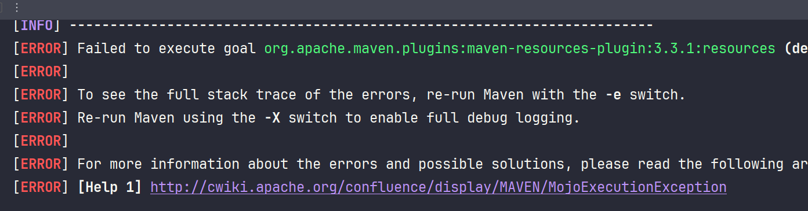

# Maven Dependencies
## Dependencies

### Erro no Maven ao compilar a aplicação



 Incluir o `plugin` no `pom.xml` conforme código: 

```xml
<!-- Failed to execute goal org.apache.maven.plugins:maven-resources-plugin:3.2.0:resources
(default-resources) on project application-etude: Input ength = 1 -->

<plugin>
    <groupId>org.apache.maven.plugins</groupId>
    <artifactId>maven-resources-plugin</artifactId>
    <version>3.1.0</version> <!--$NO-MVN-MAN-VER$ -->
</plugin>
```